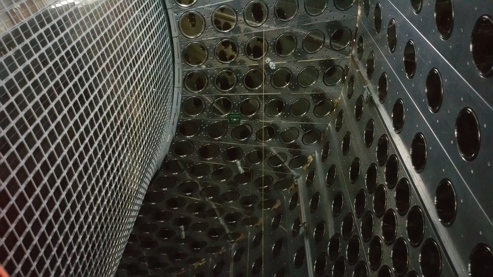
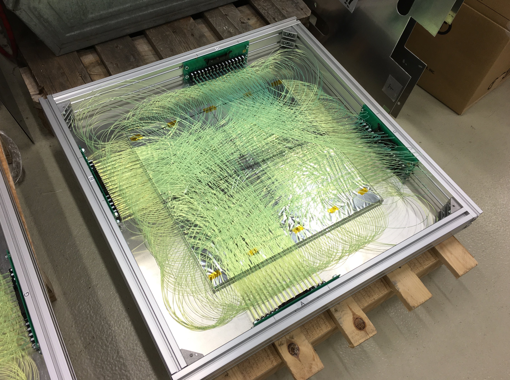

###########################
Research
###########################

Keywords: Charged Lepton Flavor Violation, Liquid Xenon, VUV-sensitive MPPC

MEG II
=============

.. image:: ../img/meg2_jp.jpg
   :scale: 10%
   :align: center

素粒子の相互作用は標準模型 (Standard Model, SM)と呼ばれる理論的な枠組みの中でほぼ全て説明されますが、暗黒物質や階層性問題といった未解決の問題を抱えています。
こうした問題を解決するために、標準理論より進んだ物理理論がいくつか提案されています。
荷電レプトンフレーバーの破れ (charged Lepton Flavor Violation)は、多くの有望な物理理論で検出可能なレベルで起こるとされている物理現象の一つです。

私が2017年から参加しているMEG II実験は、このcLFVの一つである :math:`\mu \to e \gamma` 崩壊を探索する実験です。
現在の :math:`\mu \to e \gamma` 崩壊の崩壊分岐比は、MEG II実験の前身であるMEG実験で
:math:`Br(\mu \to e \gamma) < 4.2 \times 10^{-13}(90\% C.L.)` と測定されており、
MEG II実験では検出器アップグレードによって約10倍の感度向上を見込んでいます。

私は特に液体キセノンガンマ線検出器と呼ばれる検出器に携わってきました。
MEG II実験における液体キセノンガンマ線検出器は、入射面を216本の光電子増倍管(Photo Multiplier Tube, PMT)から4092個のシリコン半導体光センサー(Multi-Pixel Photon Counter, MPPC)で置き換えることで、MEG実験を上回る精度でガンマ線計測を行うことを目指しています。

検出器の建設が終了した2017年からミューオンビームを使用した検出器の性能評価を段階的に行ってきました。
2018年には検出器の位置分解能を測定し、MEG実験からの大幅な改善を確認することができました。
一方で、長い時間ミューオンビームを使用した実験を行う中でそれまで想定していなかった光検出器の放射線損傷も発見することとなりました。
2019年からは慎重に光センサーの性能のモニターを進め、この放射線損傷の特徴を細かく調べるとともに損傷を回復する手法についても開発を進めてきました。

そして2021年、検出器の信号読み出し回路が揃い、ようやくMEG II実験初の物理データ取得に漕ぎ着けることができました。

ILC
==============================

International Linear Collider(ILC)計画は、実現すれば世界最大となる電子陽電子衝突型加速器実験です。
標準理論の枠組みではヒッグス粒子という素粒子が素粒子の質量の源ですが、最も最近(2012年)発見された素粒子でもあり、その詳細な振る舞いは完全には理解できていません。
ILC計画はこのヒッグス粒子を大量に作りだすことで、その振る舞いを詳細に調べることで標準理論を超えた物理理論の構築に貢献することができます。

私は修士1年の秋まで、ILCのアナログハドロンカロリメータ(Analog Hadron CALorimeter)という中性ハドロン検出器に関連した研究をしていました。
図はAHCALの較正用に製作した宇宙線検出器で、プラスチックシンチレーター、光ファイバー(波長変換ファイバー)とシリコン半導体光センサー(MPPC)を組み合わせて宇宙線の位置を測定します。
